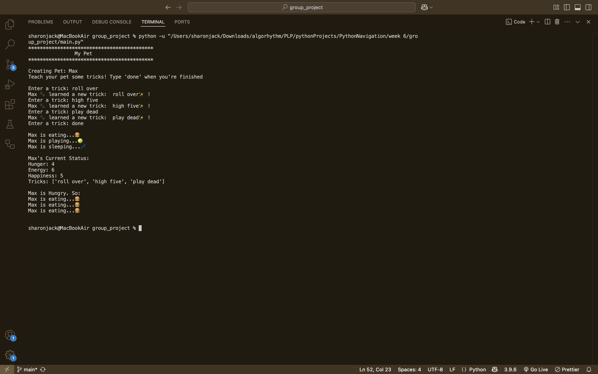

# Build Your Own Digital Pet 🐶
## Description

This project is a Build Your Own Pet where users can create a pet, let it eat, play and sleep. As well as, teach it tricks. It’s designed to solidify the understanding of object-oriented programming and Python classes.

---
## Features
- Create a pet with attributes like name, hunger, happiness, and energy
- Train your pet to learn new tricks
- Feed your pet to reduce hunger and increase happiness
- Let it sleep when tired
- Let it play to increase happiness
- Check your pet’s list of tricks

---

### Here is How The Output Looks Like:
